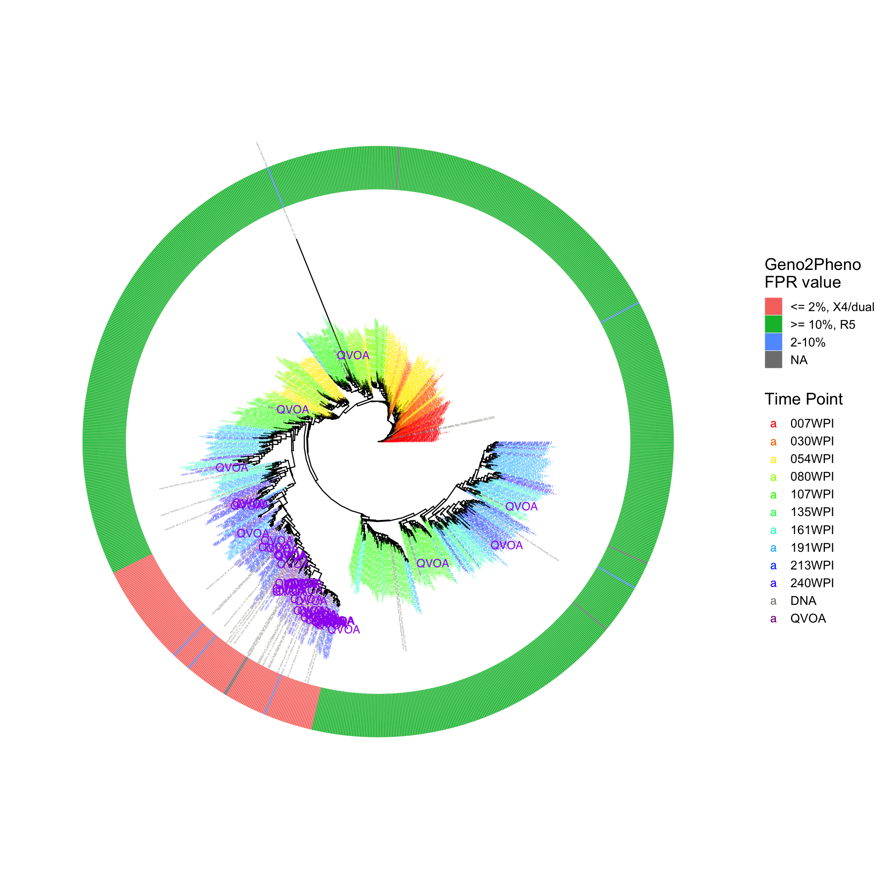

```{r setup, include=FALSE}
knitr::opts_chunk$set(echo = T, results = "asis", warning = F, message = F)
```

## Syllabus

+---------------------------+------------------------------------------------------+
| Week                      | Topic                                                |
+===========================+======================================================+
| 1                         | -   Syllabus review.                                 |
|                           |                                                      |
|                           | -   Installation of R and RStudio. Manage packages.  |
|                           |                                                      |
|                           | -   Introduction of Github.                          |
|                           |                                                      |
|                           | -   Set up project                                   |
+---------------------------+------------------------------------------------------+
| 2                         | -   R Basics                                         |
+---------------------------+------------------------------------------------------+
| 3                         | -   Summarizing data                                 |
|                           |                                                      |
|                           | -   Generate publication-ready table using `tableby` |
+---------------------------+------------------------------------------------------+
| 4                         | Plotting using R, basics                             |
|                           |                                                      |
|                           | -   Anatomy of \`ggplot\`                            |
|                           |                                                      |
|                           | -   Scatter plots                                    |
|                           |                                                      |
|                           | -   Line plots                                       |
|                           |                                                      |
|                           | -   Bar plots                                        |
|                           |                                                      |
|                           | -   Histograms                                       |
|                           |                                                      |
|                           | -   Multiple `geoms`, multiple `aes()`               |
+---------------------------+------------------------------------------------------+
| 5                         | Plotting with R, tuning plots                        |
|                           |                                                      |
|                           | -   Scales                                           |
|                           |                                                      |
|                           | -   Colors                                           |
|                           |                                                      |
|                           | -   Titles and labels                                |
|                           |                                                      |
|                           | -   Themes                                           |
|                           |                                                      |
|                           | -   Save your plot                                   |
+---------------------------+------------------------------------------------------+
| 6                         | Plotting Phylogenetic trees with R                   |
|                           |                                                      |
|                           | -   Basic of phylogenetic tree                       |
|                           |                                                      |
|                           | -   Packages to manage trees in R                    |
|                           |                                                      |
|                           | -   Loading phylogenetic tree in R                   |
|                           |                                                      |
|                           | -   Plot tree using `ggtree`                         |
+---------------------------+------------------------------------------------------+
| 7                         | Plotting Phylogenetic trees with R                   |
|                           |                                                      |
|                           | -   Link tree with data                              |
|                           |                                                      |
|                           | -   Plot tree with data                              |
|                           |                                                      |
|                           | -   Visual exploration of phylogentic trees          |
+---------------------------+------------------------------------------------------+
| 8                         | Data analysis - Continuous data                      |
+---------------------------+------------------------------------------------------+
| 9                         | Data analysis - Linear regression                    |
+---------------------------+------------------------------------------------------+
| 10                        | Data analysis - Categorical data                     |
+---------------------------+------------------------------------------------------+
| 11                        | Data analysis - Logistic regression                  |
+---------------------------+------------------------------------------------------+
| 12                        | Data analysis - Time-to-event data and survival      |
+---------------------------+------------------------------------------------------+


## What is unique in this class?

-   Using real biomedical data and cases as examples
-   Use the latest packages and features
-   Publication-ready graphics and tables


## Examples

### 1. Summarizing data and make tables using a simple package

Load required libraries

```{r}
library(tidyverse)
library(table1)
library(knitr)
library(arsenal)
library(patchwork)
library(GGally)
```


Load data from a `csv` file.

```{r}
dfall <- read_csv('data/data.csv')

dfall <- dfall %>% 
  mutate_at(c("TCS_PR","TCS_RT","TCS_IN", "TCS_V1V3", "PI_RT","PI_V1V3","DIST20_RT", "DIST20_V1V3"), funs(as.numeric)) %>% 
  mutate(
  racecat = factor(racecat, levels = c("White", "Black", "Hispanic", "Other/Unkn")),
  risk2 = factor(risk2, levels = c("MSM", "HET-F", "HET-M", 'PWID-F', 'PWID-M', 'OTHER/UNKN'))
  )

labels(dfall) <- c(ngscollectyr = 'Year of Diagnosis', 
                   gender = 'Gender',
                   racecat = 'Race',
                   age_cat30 = 'Age ≤ 30y/o',
                   risk2 = 'Risk factor',
                   recent_cat = 'Recency Category',
                   owning_jd_region_fsu = 'Region in NC',
                   incluster = 'In Clusters',
                   cd4_value = 'CD4 count (cells/µL)',
                   vl_log_value = 'Viral Load (Log10 copies/mL)'
)

```

Summarize the data, perform statistically comparison and generate publication-ready table.

Table 1. Characteristics of sequenced participants with new diagnoses in NC from 2018-2021.

```{r}

dfall %>% 
tableby(ngscollectyr ~ recent_cat + gender + racecat + age_cat30 + risk2 + owning_jd_region_fsu + incluster + cd4_value + vl_log_value, 
       data = .,cat.simplify=F, numeric.stats= c("median","q1q3"), test=T) %>% 
 summary(.,digits=1, digits.count=0, digits.pct=1, digits.p=2, title=NULL)


```

### 2. Plot TCS number at different regions by recency categories.

```{r, fig.width = 10, fig.height= 6}
df_tcs <- dfall %>% select(c(
                             "recent_cat",
                             "TCS_RT",
                             "TCS_PR",
                             "TCS_IN",
                             "TCS_V1V3"
                             )
)

tcs_chart <- function(cat, title) {
  df_tcs %>% 
  ggplot(aes(x = recent_cat, y = cat)) + 
  geom_violin() + 
  geom_jitter(aes(colour = recent_cat), size = 1, alpha = 0.5) + 
  scale_y_continuous(name = title, trans = 'log10') +
  labs(x = "Recency Category", color = "Recency Category") + 
  theme_bw() + 
    theme(axis.title.x=element_blank(),
        axis.text.x=element_blank(),
        axis.ticks.x=element_blank())
}

p1 <- tcs_chart(df_tcs$TCS_PR, "TCS# PR")
p2 <- tcs_chart(df_tcs$TCS_IN, "TCS# IN")
p3 <- tcs_chart(df_tcs$TCS_RT, "TCS# RT")
p4 <- tcs_chart(df_tcs$TCS_V1V3, "TCS# V1V3")

(p1 | p2) /
  (p3 | p4)


```

### 3. Making beautiful phylogenetic trees.

Example Tree 1 

Example Tree 2 
