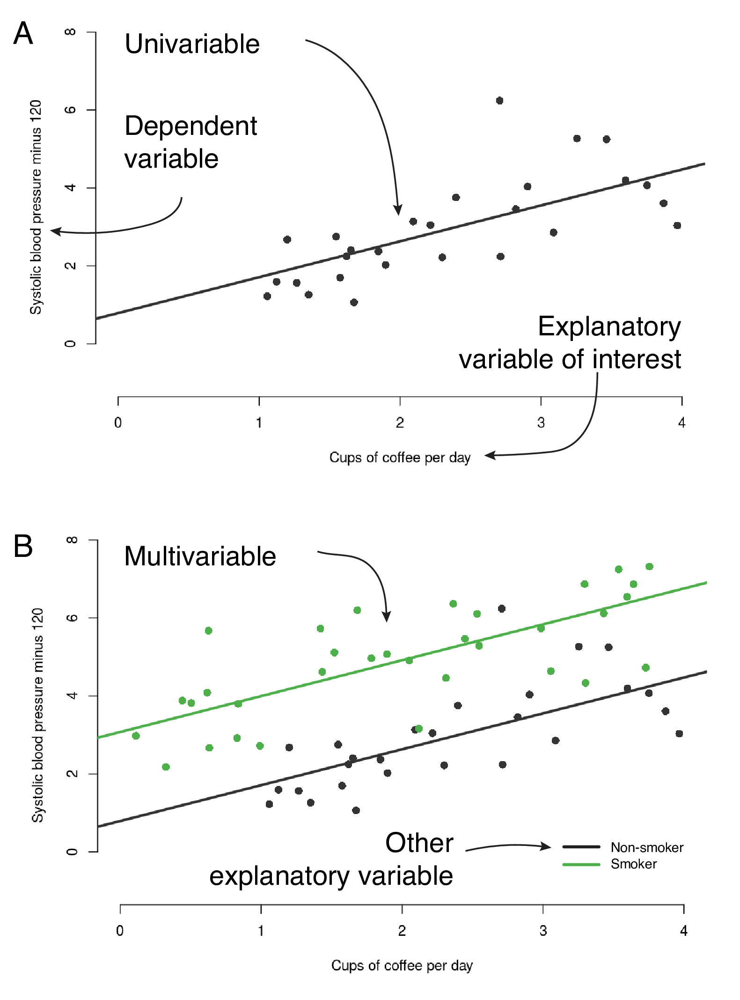
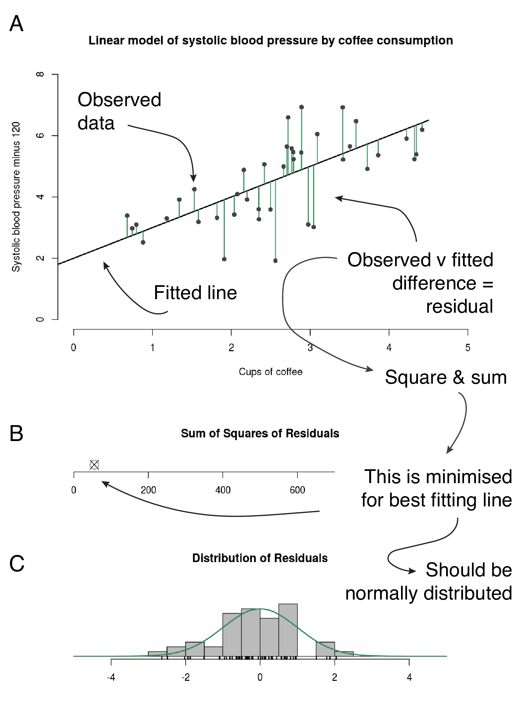
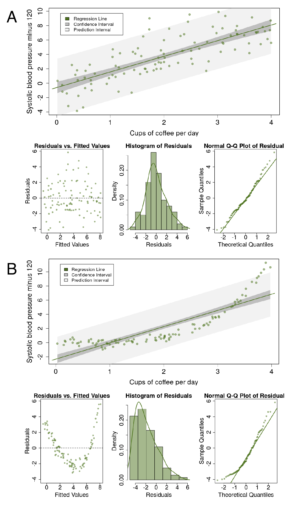
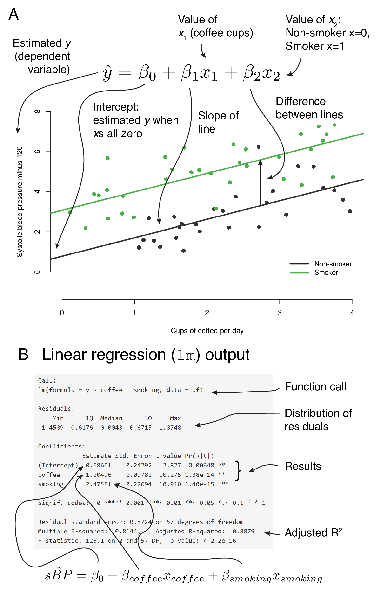
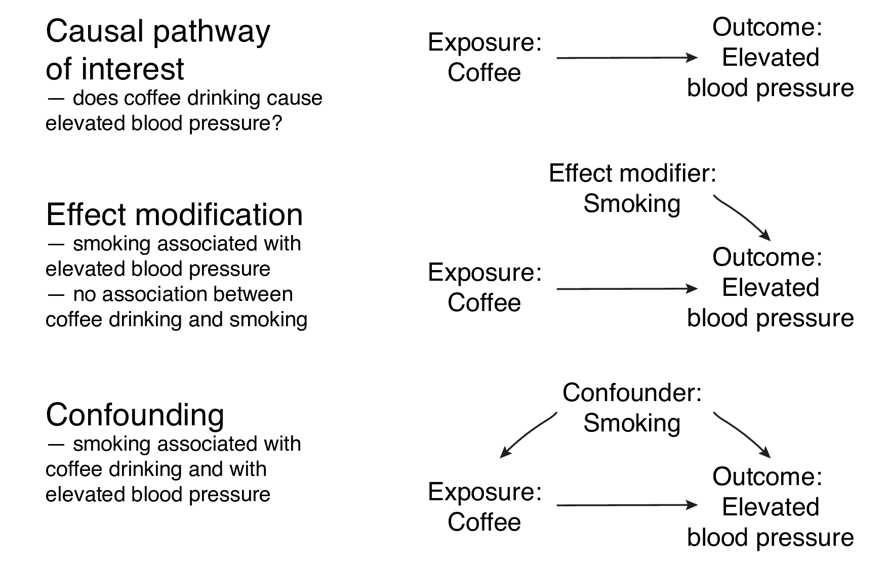
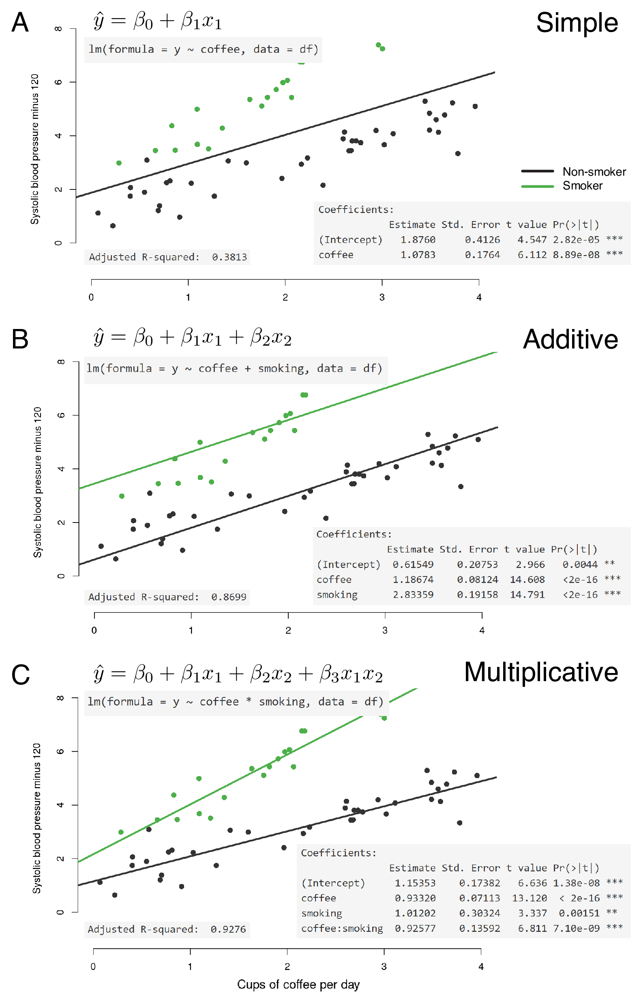

```{r setup, include=FALSE}
knitr::opts_chunk$set(echo = T, warning = F, message = F)

```

## Sync your Repo

-   Open GitHub Desktop
-   Click "Current Branch" (should be "Main")
-   You will see a branch of "upstream/main". Select branch "Main", click "Choose a branch to Merge into **Main**".
-   Choose "upstream/main", merge into your own "Main". After merging, click "Push Origin".

```{r, echo = F, message = F}
library(tidyverse)

theme_set(theme_bw())
```

## Regression

Regression is a method by which we can determine the existence and strength of the relationship between two or more variables. This can be thought of as drawing lines, ideally straight lines, through data points.

Linear regression is our method of choice for examining continuous outcome variables. Broadly, there are often two separate goals in regression:

-   Prediction: fitting a predictive model to an observed dataset, then using that model to make predictions about an outcome from a new set of explanatory variables;
-   Explanation: fit a model to explain the inter-relationships between a set of variables.



 

A clear scientific question should define:

-   `explanatory variable of interest` $(x)$, other names:

    -   exposure

    -   predictor

    -   independent variable.

-   `dependent variable` $(y)$, other names:

    -   response
    
    -   outcome

In simple linear regression, there is a single explanatory variable and a single dependent variable, and we will sometimes refer to this as *univariable linear regression*. When there is more than one explanatory variable, we will call this *multivariable regression*.

You may see the term *multivariate regression* in literature. Some people use it interchangeably with *multivariable regression*. However, *multivariate regression* means more than one dependent variable, and we should avoid using the term when referring to *multivariable regression*.

### The Question

We will illustrate our examples of linear regression using a classical question which is important to many of us! This is the relationship between coffee consumption and blood pressure (and therefore cardiovascular events, such as myocardial infarction and stroke).

Fig. 1 shows a linear regression example. Each point is a person. The explanatory variable is average number of cups of coffee per day $(x)$ and systolic blood pressure is the dependent variable $(y)$.

**These data are made up, fake, randomly generated, fabricated, not real.**

### Fitting a regression line

Simple linear regression uses the *ordinary least squares* method for fitting.

Fig. 2 shows how a regression line is fitted.



 

The maths defines a line which best fits the data provided.

For the line to fit best, the distances between it and the observed data should be as small as possible.

The distance from each observed point to the line is called a *residual*. It refers to the residual difference left over after the line is fitted.

### Linear regression assumptions

Linear regression modelling has four main assumptions:

1.  Linear relationship between predictors and outcome;
2.  Independence of residuals;
3.  Normal distribution of residuals;
4.  Equal variance of residuals.

Fig. 3 shows the diagnostic plots of the simple linear regression.

  

*Linear relationship*

A simple scatter plot should show a linear relationship between the explanatory and the dependent variable, as in Fig. 3A. If the data describe a non-linear pattern (Fig. 3B), then a straight line is not going to fit it well. In this situation, an alternative model should be considered, such as including a quadratic (squared, $x^2$) term.

*Independence of residuals*

The observations and therefore the residuals should be independent. This is more commonly a problem in time series data, where observations may be correlated across time with each other (autocorrelation).

*Normal distribution of residuals*

The observations should be normally distributed around the fitted line. This means that the residuals should show a normal distribution with a mean of zero (Fig. 3A). If the observations are not equally distributed around the line, the histogram of residuals will be skewed and a normal Q-Q plot will show residuals diverging from the straight line (Fig. 3B).

*Equal variance of residuals*

The distance of the observations from the fitted line should be the same on the left side as on the right side.

Everything we talk about in this chapter is really about making sure that the line you draw through your data points is valid. It is about ensuring that the regression line is appropriate across the range of the explanatory variable and dependent variable. It is about understanding the underlying data, rather than relying on a fancy statistical test that gives you a *p*-value.

### The fitted line and the linear equation

Fig. 4 links the fitted line, the linear equation, and the output from R.



 

Fig. 4A shows a scatter plot with fitted lines from a multivariable linear regression model.

Our model has a continuous explanatory variable of interest (average coffee consumption) and a further categorical variable (smoking).

What does $\beta_1=1$ mean? This is the slope of the line. So for each unit on the x-axis, there is a corresponding increase of one unit on the y-axis.

Fig. 4B shows the default output in R for this linear regression model.

In this example, the random sample from our true population specified above shows $intercept=0.67$, $\beta_1=1.00$ (coffee), and $\beta_2=2.48$ (smoking). A *p*-value is provided ($Pr(> \left| t \right|)$), which is the result of a null hypothesis significance test for the slope of the line being equal to zero.

### Effect modification

Effect modification occurs when the size of the effect of the explanatory variable of interest (exposure) on the outcome (dependent variable) differs depending on the level of a third variable. Said another way, this is a situation in which an explanatory variable differentially (positively or negatively) modifies the observed effect of another explanatory variable on the outcome.

Fig. 5 shows three potential causal pathways.



 

In the first, smoking is not associated with the outcome (blood pressure) or our explanatory variable of interest (coffee consumption).

In the second, smoking is associated with elevated blood pressure, but not with coffee consumption. This is an example of effect modification.

In the third, smoking is associated with elevated blood pressure and with coffee consumption. This is an example of confounding.

*Additive vs. multiplicative effect modification (interaction)*

Effect modification can be additive or multiplicative.

Fig. 6 should make it clear exactly how these work. The data have been set up to include an interaction between the two explanatory variables. What does this mean?



 

-   $intercept$: the blood pressure ($\hat{y}$) for non-smokers who drink no coffee (all $x=0$);
-   $\beta_1$ (`coffee`): the additional blood pressure for each cup of coffee drunk by non-smokers (slope of the line when $x_2=0$);
-   $\beta_2$ (`smoking`): the difference in blood pressure between non-smokers and smokers who drink no coffee ($x_1=0$);
-   $\beta_3$ (`coffee:smoking` interaction): the blood pressure ($\hat{y}$) in addition to $\beta_1$ and $\beta_2$, for each cup of coffee drunk by smokers ($x_2=1)$.

With the additive model, the fitted lines for non-smoking vs smoking must always be parallel (the statistical term is 'constrained') (Fig. 6B).

A statistical interaction (or multiplicative effect modification) is a situation where the effect of an explanatory variable on the outcome is modified in non-additive manner. In other words using our example, the fitted lines are no longer constrained to be parallel.

If we had not checked for an interaction effect, we would have inadequately described the true relationship between these three variables.

What does this mean back in reality? Well it may be biologically plausible for the effect of smoking on blood pressure to increase multiplicatively due to a chemical interaction between cigarette smoke and caffeine, for example.

Note, we are just trying to find a model which best describes the underlying data. All models are approximations of reality.

### R-squared and model fit

Fig. 6 includes a further metric from the R output: `Adjusted R-squared`.

R-squared is another measure of how close the data are to the fitted line. It is also known as the *coefficient of determination* and represents the proportion of the dependent variable which is explained by the explanatory variable(s). So 0.0 indicates that none of the variability in the dependent is explained by the explanatory (no relationship between data points and fitted line) and 1.0 indicates that the model explains all of the variability in the dependent (fitted line follows data points exactly).

R provides the `R-squared` and the `Adjusted R-squared`. The adjusted R-squared includes a penalty the more explanatory variables are included in the model. So if the model includes variables which do not contribute to the description of the dependent variable, the adjusted R-squared will be lower.

Looking again at Fig. 6, in A, a simple model of coffee alone does not describe the data well (adjusted R-squared 0.38). Adding smoking to the model improves the fit as can be seen by the fitted lines (0.87). But a true interaction exists in the actual data. By including this interaction in the model, the fit is very good indeed (0.93).

### Summary

We have intentionally spent some time going through the principles and applications of linear regression because it is so important. A firm grasp of these concepts leads to an understanding of other regression procedures, such as logistic regression and Cox Proportional Hazards regression, even machine learning. 

We will now perform all this ourselves in R using the gapminder dataset which you are familiar with from preceding chapters.

## Fitting simple models

### The Question

We are interested in modelling the change in life expectancy for different countries over the past 60 years.

### Get the data

```{r, message=F}
library(tidyverse)
library(gapminder) # dataset
library(finalfit)
library(broom)

theme_set(theme_bw())
gapdata <- gapminder
```

### Check the data

Always check a new dataset

```{r eval=FALSE}
glimpse(gapdata) # each variable as line, variable type, first values
missing_glimpse(gapdata) # missing data for each variable
ff_glimpse(gapdata) # summary statistics for each variable
```

### Plot the data

Let's plot the life expectancies in American countries over the past 60 years. We can add in simple best fit lines using `geom_smooth()`.

```{r, fig.height=5, fig.width=7, fig.cap="Scatter plots with linear regression lines: Life expectancy by year in American countries."}
gapdata %>%                        
  filter(continent == "Americas") %>%    # Americas only
  ggplot(aes(x = year, y = lifeExp)) + # lifeExp~year  
  geom_point() +                       # plot points
  facet_wrap(~ country) +              # facet by country
  scale_x_continuous(
    breaks = c(1960, 2000)) +          # adjust x-axis 
  geom_smooth(method = "lm")           # add regression lines

```

### Simple linear regression

`ggplot()` is very easy to run and plot linear regression models for us. While this is convenient for a quick look, we usually want to build, run, and explore these models ourselves. We can then investigate the intercepts and the slope coefficients (linear increase per year):

First let's plot two countries to compare, US and United Brazil:

```{r fig.height=3, fig.width=4.5, fig.cap="Scatter plot: Life expectancy by year: United States and Brazil"}
gapdata %>% 
  filter(country %in% c("United States", "Brazil")) %>% 
  ggplot(aes(x = year, y = lifeExp, color = country)) + 
  geom_point()
```

First, let's model the two countries separately.

```{r}
# United States
fit_us <- gapdata %>%
  filter(country == "United States") %>% 
  lm(lifeExp~year, data = .)

fit_us %>% 
  summary()

```

```{r}
# Brazil
fit_brazil <- gapdata %>%
  filter(country == "Brazil") %>% 
  lm(lifeExp~year, data = .)

fit_brazil %>% 
  summary()
```

A simple linear regression model will return two coefficients - the intercept and the slope (the second returned value). Compare these coefficients to the `summary()` output above to see where these numbers came from.

```{r}
fit_us$coefficients 
```

```{r}
fit_brazil$coefficients
```

The slopes make sense - the results of the linear regression say that in the US, life expectancy increases by `r fit_us$coefficients[2] %>% round(3)` every year, whereas in Brazil the change is `r fit_brazil$coefficients[2] %>% round(3)` per year. The reason the intercepts are negative, however, may be less obvious.

In this example, the intercept is telling us that life expectancy at year 0 in the US (some 2000 years ago) was `r fit_us$coefficients[1] %>% round(0)` years. While this is mathematically correct (based on the data we have), it obviously makes no sense in practice. It is important to think about the range over which you can extend your model predictions, and where they just become unrealistic.

To make the intercepts meaningful, we will add in a new column called `year_from1952` and re-run `fit_us` and `fit_brazil` using `year_from1952` instead of `year`.

```{r}
gapdata <- gapdata %>% 
  mutate(year_from1952 = year - 1952)

fit_us <- gapdata %>%
  filter(country == "United States") %>% 
  lm(lifeExp ~ year_from1952, data = .)

fit_brazil <- gapdata %>%
  filter(country == "Brazil") %>% 
  lm(lifeExp ~ year_from1952, data = .)
```


```{r}
fit_us$coefficients 
```

```{r}
fit_brazil$coefficients
```

Now, the updated results tell us that in year 1952, the life expectancy in the United States was `r fit_us$coefficients[1] %>% round(0)` years. 
Note that the slopes do not change.
There was nothing wrong with the original model and the results were correct, the intercept was just not meaningful.

*Accessing all model information `tidy()` and `glance()`*

In the fit_us and fit_brazil examples above, we were using `fit_us %>% summary()` to get R to print out a summary of the model.
This summary is not, however, in a table format  so we can't easily access the values or use as information on plot labels.

We use the `tidy()` function from `library(broom)` to get the variable(s) and specific values in a nice tibble:

```{r}
fit_us %>% tidy()
```

In the `tidy()` output, the column `estimate` includes both the intercepts and slopes.

And we use the `glance()` function to get overall model statistics (mostly the r.squared).

```{r}
fit_us %>% glance()
```

### Multivariable linear regression

Multivariable linear regression includes more than one explanatory variable.
There are a few ways to include more variables, depending on whether they should share the intercept and how they interact:

Simple linear regression (exactly one predictor variable):

`myfit = lm(lifeExp ~ year, data = gapdata)`

Multivariable linear regression (additive):

`myfit = lm(lifeExp ~ year + country, data = gapdata)`

Multivariable linear regression (interaction):

`myfit = lm(lifeExp ~ year * country, data = gapdata)`

This equivalent to:
`myfit = lm(lifeExp ~ year + country + year:country, data = gapdata)`

These examples of multivariable regression include two variables: `year` and `country`, but we could include more by adding them with `+`, it does not just have to be two.

We will now create three different linear regression models to further illustrate the difference between a simple model, additive model, and multiplicative model.

Model 1: year only*

```{r fig.height=3, fig.width=4.5, fig.cap="Scatter and line plot. Life expectancy in Brazil and the US - univariable fit."}

gapdata_US_B <- gapdata %>% 
  filter(country %in% c("Brazil", "United States"))

fit_both1 <- gapdata_US_B %>% 
  lm(lifeExp ~ year_from1952, data = .)
fit_both1 %>% summary()

gapdata_US_B %>% 
  ggplot(aes(x = year, y = lifeExp)) + 
  geom_point(aes(color = country)) +
  geom_smooth(method = 'lm', color = 'black', se = F)
```

By fitting to year only (`lifeExp ~ year_from1952`), the model ignores country.
This gives us a fitted line which is the average of life expectancy in the US and Brazil. 
This may be desirable, depending on the question.
But here we want to best describe the data. 


*Model 2: year + country*
```{r fig.height=3, fig.width=4.5, fig.cap="Scatter and line plot. Life expectancy in Brazil and the US - multivariable additive fit."}
fit_both2 <- gapdata_US_B %>% 
  lm(lifeExp ~ year_from1952 + country, data = .)
fit_both2 %>% summary()

gapdata_US_B %>% 
  mutate(pred_lifeExp = predict(fit_both2)) %>% 
  ggplot() + 
  geom_point(aes(x = year, y = lifeExp, color = country)) +
  geom_line(aes(x = year, y = pred_lifeExp, color = country))
```

This is better, by including country in the model, we now have fitted lines more closely representing the data.
However, the lines are constrained to be parallel. 
This is the additive model that was discussed above.
We need to include an interaction term to allow the effect of year on life expectancy to vary by country in a non-additive manner.

*Model 3: year &ast; country*

```{r fig.height=3, fig.width=4.5, fig.cap="Scatter and line plot. Life expectancy in Brazil and the US - multivariable multiplicative fit."}
fit_both3 <- gapdata_US_B %>% 
  lm(lifeExp ~ year_from1952 * country, data = .)
fit_both3 %>% summary()

gapdata_US_B %>% 
  mutate(pred_lifeExp = predict(fit_both3)) %>% 
  ggplot() + 
  geom_point(aes(x = year, y = lifeExp, color = country)) +
  geom_line(aes(x = year, y = pred_lifeExp, color = country))
```

This fits the data much better than the previous two models.
You can check the R-squared using `summary(fit_both3)`.

The above figure can be generated by the `geom_smooth()` from ggplot() without using `predict`.

```{r fig.height=3, fig.width=4.5}
gapdata_US_B %>% 
  ggplot(aes(x = year, y = lifeExp, color = country)) + 
  geom_point() +
  geom_smooth(method = 'lm', se = F)
```

### Check assumptions

The assumptions of linear regression can be checked with diagnostic plots, either by passing the fitted object (`lm()` output) to base R `plot()`, or by using the more convenient function below. 

```{r chap07-diags-example, fig.height=5, fig.width=5.4, fig.cap="Diagnostic plots. Life expectancy in Brazil and the US - multivariable multiplicative model."}
library(ggfortify)
autoplot(fit_both3)
```