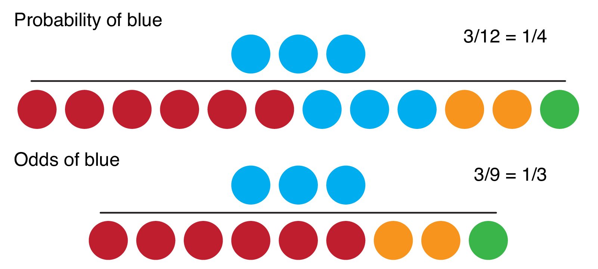
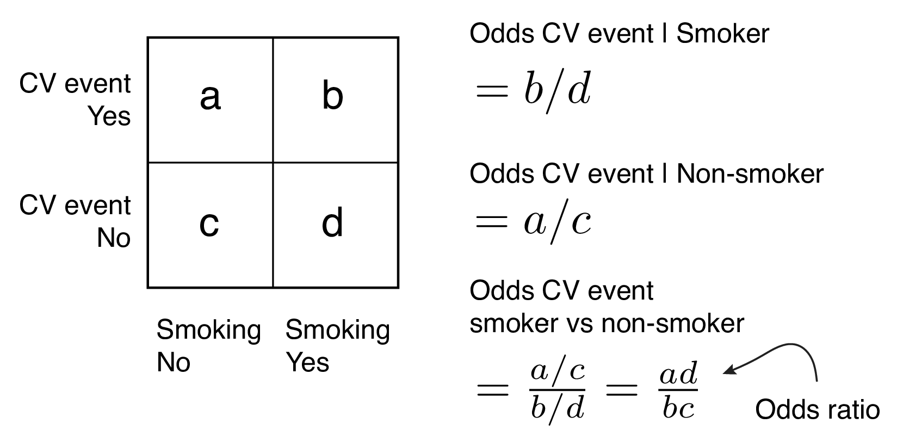
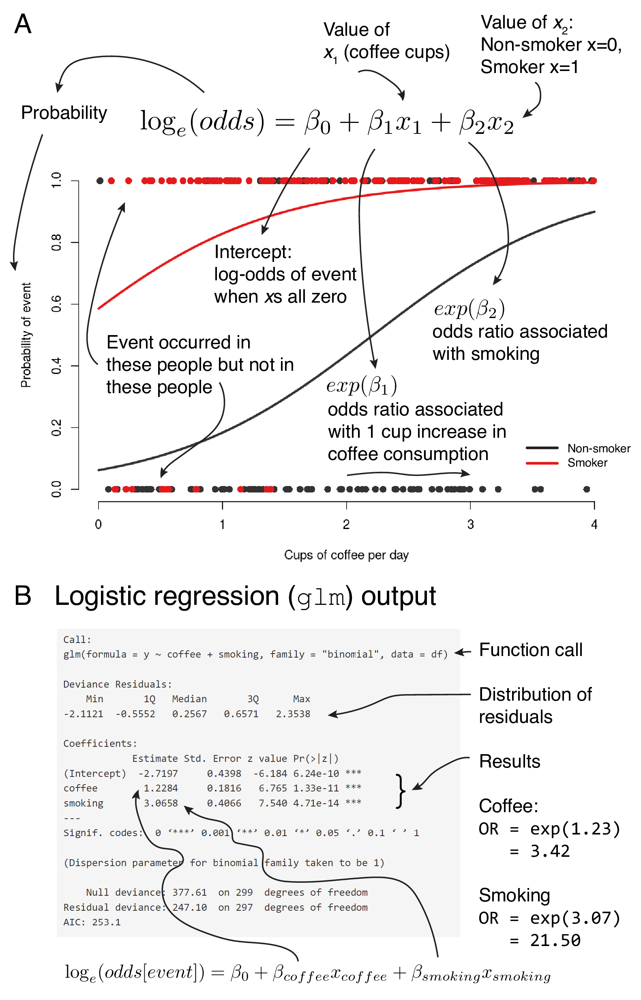
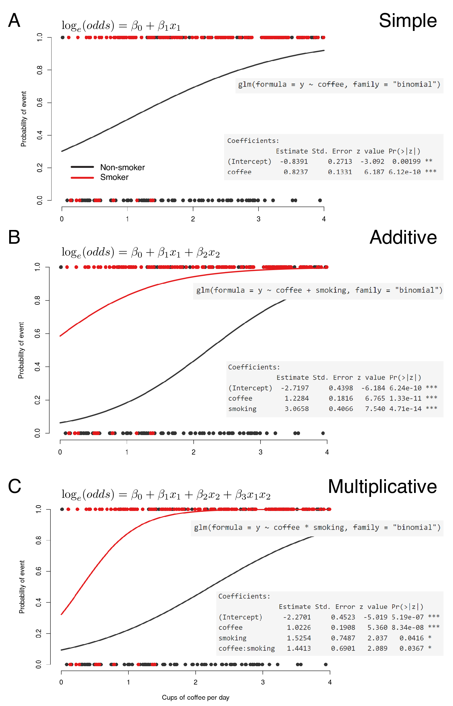
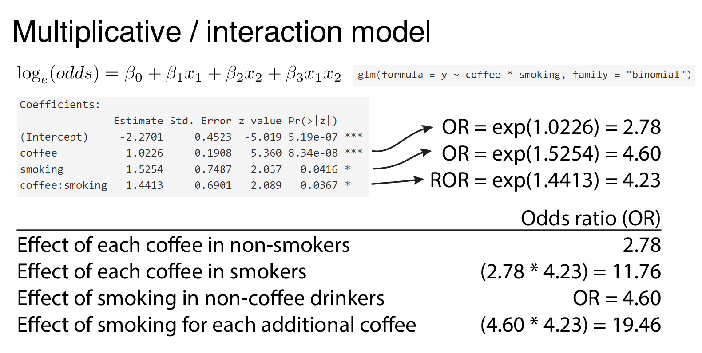

```{r setup, include=FALSE}
knitr::opts_chunk$set(echo = T, warning = F, message = F)

```

## Sync your Repo

-   Open GitHub Desktop
-   Click "Current Branch" (should be "Main")
-   You will see a branch of "upstream/main". Select branch "Main", click "Choose a branch to Merge into **Main**".
-   Choose "upstream/main", merge into your own "Main". After merging, click "Push Origin".

## Generalized linear modelling

Generalized linear modelling is an extension to the linear modelling. It allows the principles of linear regression to be applied when outcomes are not continuous numeric variables.

## Binary logistic regression

-   A regression analysis is a statistical approach to estimating the relationships between variables, often by drawing straight lines through data points.

-   Logistic regression is an extension of this, where the variable being predicted is categorical.

-   We will focus on binary logistic regression, where the dependent variable has two levels, e.g., yes or no, 0 or 1, dead or alive. Other types of logistic regression include 'ordinal', when the outcome variable has \>2 ordered levels, and 'multinomial', where the outcome variable has \>2 levels with no inherent order.

-   Although in binary logistic regression the outcome must have two levels, remember that the predictors (explanatory variables) can be either continuous or categorical.

### The Question

We return to our example of coffee drinking.

Our outcome variable was previously blood pressure. We will now consider our outcome as the occurrence of a cardiovascular (CV) event over a 10-year period.

The diagnosis of a cardiovascular event is clearly a binary condition, it either happens or it does not. This is ideal for modelling using binary logistic regression.

### Odds and probabilities

 Fig. 1: Probability vs odds.

When a probability is 0, the odds are 0. When a probability is between 0 and 0.5, the odds are less than 1.0 (i.e., less than "1 to 1"). As probability increases from 0.5 to 1.0, the odds increase from 1.0 to approach infinity.

Thus the range of probability is 0 to 1 and the range of odds is 0 to $+\infty$.

Odds and probabilities can easily be interconverted.

$Odds = \frac{p}{1-p}$, where $p$ is the probability of the outcome occurring.

$Probability = \frac{odds}{odds+1}$.

### Odds ratio

Another important term to remind ourselves of is the 'odds ratio'. Why? Because in a logistic regression the slopes of fitted lines (coefficients) can be interpreted as odds ratios. This is very useful when interpreting the association of a particular predictor with an outcome.

For a given categorical predictor such as smoking, the difference in chance of the outcome occurring for smokers vs non-smokers can be expressed as a ratio of odds or odds ratio (Fig. 2). For example, if the odds of a smoker having a CV event are 1.5 and the odds of a non-smoker are 1.0, then the odds of a smoker having an event are 1.5-times greater than a non-smoker, odds ratio = 1.5.

 Fig. 2: Odds ratio

An alternative is a ratio of probabilities which is called a risk ratio or relative risk (RR)

### Fitting a regression line

Fig. 3. links the logistic regression equation, the appearance of the fitted lines on the probability scale, and the output from a standard base R analysis.

-   The dots at the top and bottom of the plot represent whether individual patients have had an event or not.

-   The fitted line, therefore, represents the point-to-point probability of a patient with a particular set of characteristics having the event or not.

-   For a continuous variable such as cups of coffee consumed, the odds ratio is the change in odds of a CV event associated with a 1 cup increase in coffee consumption. We are dealing with linear responses here, so the odds ratio is the same for an increase from 1 to 2 cups, or 3 to 4 cups etc. Remember that if the odds ratio for 1 unit of change is 1.5, then the odds ratio for 2 units of change is $exp(log(1.5)*2) = 2.25$.

-   For a categorical variable such as smoking, the odds ratio is the change in odds of a CV event associated with smoking compared with not smoking (the reference level).

 Fig. 3: Linking the logistic regression fitted line and equation (A) with the R output (B).

### Effect modification and confounding

As with all multivariable regression models, logistic regression allows the incorporation of multiple variables which all may have direct effects on outcome or may confound the effect of another variable.

Fig. 4 demonstrates simple, additive and multiplicative models.

 Fig. 4: Multivariable logistic regression (A) with additive (B) and multiplicative (C) effect modification.

The interpretation of the interaction term is important. The exponential of the interaction coefficient term represents a 'ratio-of-odds ratios'. This is easiest to see through a worked example.

 Fig. 5: Multivariable logistic regression with interaction term. The exponential of the interaction term is a ratio-of-odds ratios (ROR).

## Data preparation and exploratory analysis

### Question

We will go on to explore the `boot::melanoma` dataset we used before.

The data consist of measurements made on patients after surgery to remove the melanoma skin cancer in the University Hospital of Odense, Denmark, between 1962 and 1977.

Malignant melanoma is an aggressive and highly invasive cancer, making it difficult to treat.

To determine how advanced it is, staging is based on the depth of the tumor. The current TNM classification cut-offs are:

-   T1: $\leq$ 1.0 mm depth
-   T2: 1.1 to 2.0 mm depth
-   T3: 2.1 to 4.0 mm depth
-   T4: \> 4.0 mm depth

This will be important in our analysis as we will create a new variable based upon this.

Using logistic regression, we will investigate factors associated with death from malignant melanoma with particular interest in tumor ulceration.

### Get the data

```{r}
melanoma <- boot::melanoma
```

### Check the data

As before, always carefully check and clean new dataset before you start the analysis.

```{r}
library(tidyverse)
library(finalfit)
library(arsenal)
theme_set(theme_bw())

melanoma %>% ff_glimpse()
```

### Recode the data

```{r}
melanoma <- melanoma %>% 
  mutate(sex.factor = factor(sex) %>%          
           fct_recode("Female" = "0",
                      "Male"   = "1"),   
         
         ulcer.factor = factor(ulcer) %>% 
           fct_recode("Present" = "1",
                      "Absent"  = "0") ,
         
         age  = ff_label(age,  "Age (years)"),
         year = ff_label(year, "Year"),
         
         status.factor = factor(status) %>% 
           fct_recode("Died melanoma"  = "1",
                      "Alive" = "2",
                      "Died - other" = "3") %>% 
           fct_relevel("Alive"),
         
         t_stage.factor = 
           thickness %>% 
           cut(breaks = c(0, 1.0, 2.0, 4.0, 
                          max(thickness, na.rm=TRUE)),
               include.lowest = TRUE)
  )
```

Check the `cut()` function has worked:

```{r}
melanoma$t_stage.factor %>% levels()
```

Recode for ease.

```{r}
melanoma <- melanoma %>% 
  mutate(
    t_stage.factor = 
      fct_recode(t_stage.factor,
                 "T1" = "[0,1]",
                 "T2" = "(1,2]",
                 "T3" = "(2,4]",
                 "T4" = "(4,17.4]")
  )
```

Add labels

```{r}

labels(melanoma) <- c(
  sex.factor = "Sex",
  ulcer.factor = "Ulcerated tumor",
  status.factor = "Status",
  t_stage.factor = "T-stage"
)

```

We will now consider our outcome variable. With a binary outcome and health data, we often have to make a decision as to *when* to determine if that variable has occurred or not.

Our outcome of interest is death from melanoma, but we need to decide when to define this.

A quick histogram of `time` stratified by `status.factor` helps. We can see that most people who died from melanoma did so before 5 years. We can also see that the status most of those who did not die is known beyond 5 years.

```{r, fig.height=3.5, fig.width=6, message=TRUE, fig.cap = "Time to outcome/follow-up times for patients in the melanoma dataset."}
library(ggplot2)
melanoma %>% 
  ggplot(aes(x = time/365.25)) + 
  geom_histogram() + 
  facet_grid(. ~ status.factor)
```

Let's decide then to look at 5-year mortality from melanoma. The definition of this will be at 5 years after surgery, who had died from melanoma and who had not.

```{r}
# 5-year mortality
melanoma <- melanoma %>% 
  mutate(
    mort_5yr = 
      if_else((time/365.25) < 5 & 
                (status == 1), 
              "Yes",          # then
              "No") %>%       # else
      fct_relevel("No")
  )

labels(melanoma) = c(mort_5yr = "5-year survival")
```

### Plot the data

We are interested in the association between tumor ulceration and outcome.

```{r, fig.height=3, fig.width=5, fig.cap = "Exploration ulceration and outcome (5-year mortality)."}
p1 <- melanoma %>% 
  ggplot(aes(x = ulcer.factor, fill = mort_5yr)) + 
  geom_bar() + 
  theme(legend.position = "none")

p2 <- melanoma %>% 
  ggplot(aes(x = ulcer.factor, fill = mort_5yr)) + 
  geom_bar(position = "fill") + 
  ylab("proportion")

library(patchwork)
p1 + p2
```

As we might have anticipated from our work in the previous chapter, 5-year mortality is higher in patients with ulcerated tumors compared with those with non-ulcerated tumors.

We are also interested in other variables that may be associated with tumor ulceration. If they are also associated with our outcome, then they will confound the estimate of the direct effect of tumor ulceration.

We can plot out these relationships, or tabulate them instead.

### Tabulate the data

We will use the `tableby` from the `arsenal` package to look for differences across other variables by tumor ulceration.

```{r, results = "asis"}
tab = tableby(ulcer.factor ~ age + sex.factor + year + t_stage.factor, data = melanoma)
summary(tab)
```

## Model assumptions

The main assumptions are:

1.  Binary dependent variable - this is obvious, but as above we need to check (alive, death from disease, death from other causes doesn't work);

2.  Independence of observations - the observations should not be repeated measurements or matched data;

3.  Linearity of continuous explanatory variables and the log-odds outcome - take age as an example. If the outcome, say death, gets more frequent or less frequent as age rises, the model will work well. However, say children and the elderly are at high risk of death, but those in middle years are not, then the relationship is not linear. Or more correctly, it is not monotonic, meaning that the response does not only go in one direction;

4.  No multicollinearity - explanatory variables should not be highly correlated with each other.

## Fitting logistic regression models with `finalfit`

Our preference in model fitting is now to use our own **finalfit** package. 
It gets us to our results quicker and more easily, and produces our final model tables which go directly into manuscripts for publication.

```{r}

dependent <- "mort_5yr"
explanatory <- "ulcer.factor"
melanoma %>% 
  finalfit(dependent, explanatory, metrics = TRUE) 
```

### Criterion-based model fitting

Passing `metrics = TRUE` to `finalfit()` gives us a useful list of model fitting parameters. 

We recommend looking at three metrics:

* Akaike information criterion (AIC), which should be minimised,
* C-statistic (area under the receiver operator curve), which should be maximised;
* Hosmer–Lemeshow test, which should be non-significant.

## Modelling strategy for binary outcomes

A statistical model is a tool to understand the world. 
The better your model describes your data, the more useful it will be.
Fitting a successful statistical model requires decisions around which variables to include in the model. 
Our advice regarding variable selection follows the same lines as in the linear regression chapter. 

1. As few explanatory variables should be used as possible (parsimony);
2. Explanatory variables associated with the outcome variable in previous studies should be accounted for; 
3. Demographic variables should be included in model exploration; 
4. Population stratification should be incorporated if available; 
5. Interactions should be checked and included if influential; 
6. Final model selection should be performed using a "criterion-based approach"
+ minimise the Akaike information criterion (AIC)
+ maximise the c-statistic (area under the receiver operator curve).

## Multivariable regression with `finalfit`

There should be exploration with all the parameters to find the best fit of the model. But we will not cover it in this workshop.

First of all, we would like to group the age.

```{r}
melanoma <- melanoma %>% 
  mutate(
    age.factor = cut(age,
                     breaks = c(0, 25, 50, 75, 100))
)

labels(melanoma) = c(age.factor = "Age (years)")
```

Then we fit the model

```{r}
dependent <- "mort_5yr"
explanatory <- c("ulcer.factor", "age.factor", 
                "sex.factor", "t_stage.factor")
explanatory_multi <- c("ulcer.factor", "t_stage.factor")
melanoma %>% 
  finalfit(dependent, explanatory, explanatory_multi, metrics = TRUE)
```

###  Odds ratio plot

```{r}
dependent <- "mort_5yr"
explanatory_multi <- c("ulcer.factor", "t_stage.factor")
melanoma %>% 
  or_plot(dependent, explanatory_multi,
          breaks = c(0.5, 1, 2, 5, 10, 25),
          table_text_size = 3.5,
          title_text_size = 16)
```

We can conclude that there is evidence of an association between tumour ulceration and 5-year survival which is independent of the tumour depth as captured by T-stage.
