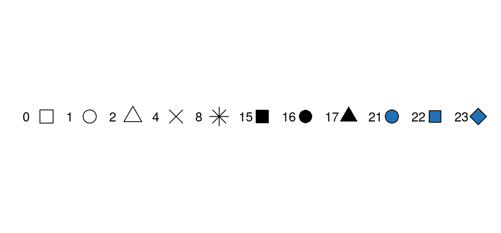

```{r setup, include=FALSE}
knitr::opts_chunk$set(echo = TRUE)
```

# Plotting using R

## 1. Week 4

-   Anatomy of `ggplot`
-   Scatter plots
-   Line plots

## 2. Week 5

-   Bar Plots
-   Histograms
-   Multiple geoms, multiple `aes()`
-   All other plots

## 3. Week 6, Tuning plots

-   Scales
-   Colors
-   Titles and labels
-   Themes
-   Save your plot

## Sync your Repo

-   Open GitHub Desktop
-   Click "Current Branch" (should be "Main")
-   You will see a branch of "upstream/main". Select branch "Main", click "Choose a branch to Merge into **Main**".
-   Choose "upstream/main", merge into your own "Main". After merging, click "Push Origin".

## Get the data

We are using the gapminder dataset (<https://www.gapminder.org/data>) that has been put into an R package by @bryan2017 so we can load it with `library(gapminder)`.


```{r, message=F, include = TRUE}
library(tidyverse)
library(gapminder)

glimpse(gapminder)
view(gapminder)
```


You can check that all of the numbers quoted above are correct with these lines:

```{r, results = "hide"}

gapminder$year %>% unique()
gapminder$country %>% n_distinct()
gapminder$continent %>% unique()
```

Let's create a new shorter tibble called `gapdata2007` that only includes data for the year 2007.

```{r, results = "hide"}
gapdata2007 <- gapminder %>% 
  filter(year == 2007)

gapdata2007
```

The new tibble - `gapdata2007` - now shows up in your Environment tab, whereas `gapminder` does not.
Running `library(gapminder)` makes it available to use, but to have it appear in your normal Environment tab you'll need to run this line:

```{r}
# loads the gapminder dataset from the package environment
# into your Global Environment
gapdata <- gapminder
```

Both `gapdata` and `gapdata2007` now show up in the Environment tab and can be clicked on/quickly viewed as usual.

## Anatomy of ggplot explained 

Let's take a look at an example.

```{r, fig.height= 8, fig.width= 6, warning = F}

gapdata2007 %>% 
  ggplot(
    aes(y = lifeExp, 
        x = gdpPercap, 
        color = continent, 
        fill = continent)) +
  geom_point(alpha = 0.3 )+
  theme_bw() +
  geom_smooth(method = "lm", se = T) +
  scale_color_brewer(palette = "Set1") + 
  scale_x_log10() + 
  scale_y_continuous(limits = c(30,100)) +
  labs(
    title = "Health and economics",
    subtitle = "Gapminder dataset, 2007",
    x = "Gross domestic product per capita",
    y = 'Life Expectancy',
    caption = Sys.Date(),
    tag = "p13"
    ) + 
  theme(legend.position=c(.5,.9),
        legend.direction = "horizontal",
        legend.background = element_rect(
          fill="ghostwhite", 
          size=0.5, 
          linetype="solid", 
          color = "lightgrey"
          ),
        plot.background = element_rect(
          colour = "black", 
          fill=NA, 
          size=0.5)
        ) 

  

  
```

**(1)** Start by defining the variables, e.g., `ggplot(aes(x = var1, y = var2))`:

```{r}
gapdata2007 %>% 
  ggplot(aes(x = gdpPercap, y = lifeExp))
```


The above code is equivalent to:

```{r}
ggplot(gapdata2007, aes(x = gdpPercap, y = lifeExp))
```

We tend to put the data first and then use the pipe (`%>%`) to send it to the `ggplot()` function.
This becomes useful when we add further data wrangling functions between the data and the `ggplot()`.
For example, our plotting pipelines often look like this:

```{r, fig.keep = 'none', eval = FALSE}
data %>% 
  filter(...) %>% 
  mutate(...) %>% 
  ggplot(aes(...)) +
  ...
```

The lines that come before the `ggplot()` function are piped, whereas from `ggplot()` onwards you have to use +.
This is because we are now adding different layers and customizations to the same plot.


`aes()` stands for **aes**thetics - things we can see.
Variables are always inside the `aes()` function, which in return is inside a `ggplot()`.

**(2)** Choose and add a geometrical object

Let's ask `ggplot()` to draw a point for each observation by adding `geom_point()`:

```{r}
gapdata2007 %>% 
  ggplot(aes(x = gdpPercap, y = lifeExp)) +
  geom_point()
```

We have now created a scatter plot.

If we copy the above code and change just one thing - the `x` variable from `gdpPercap` to `continent` (which is a categorical variable) - we get what's called a strip plot.
This means we are now plotting a continuous variable (`lifeExp`) against a categorical one (`continent`).
But the thing to note is that the rest of the code stays exactly the same, all we did was change the `x =`.

```{r}
gapdata2007 %>% 
  ggplot(aes(x = continent, y = lifeExp)) +
  geom_point()
```

**(3)** specifying further variables inside `aes()`

Going back to the scatter plot (`lifeExp` vs `gdpPercap`), let's use `continent` to give the points some color.
We can do this by adding `color = continent` inside the `aes()`:

```{r}
gapdata2007 %>% 
  ggplot(aes(x = gdpPercap, y = lifeExp, color = continent)) +
  geom_point()
```

It uses the default color scheme and will automatically include a legend.
Still with just two lines of code (`ggplot(...)` + `geom_point()`).

**(4)** specifying aesthetics outside `aes()`

It is very important to understand the difference between including `ggplot` arguments inside or outside of the `aes()` function.

The main aesthetics (things we can see) are: **x**, **y**, **color**, **fill**, **shape**, **size**, and any of these could appear inside or outside the `aes()` function.
Press F1 on, e.g., `geom_point()`, to see the full list of aesthetics that can be used with this geom (this opens the Help tab).
If F1 is hard to summon on your keyboard, type in and run `?geom_point`.

Variables (so columns of your dataset) have to be defined inside `aes()`.
Whereas to apply a modification on everything, we can set an aesthetic to a constant value outside of `aes()`.

For example, the following figure shows a selection of the point shapes built into R.
The default shape used by `geom_point()` is number 16.


To make all of the points in our figure hollow, let's set their shape to 1.
We do this by adding `shape = 1` inside the `geom_point()`:


```{r}
gapdata2007 %>% 
  ggplot(aes(x = gdpPercap, y = lifeExp, color = continent)) +
  geom_point(shape = 1)
```

What if we put `shape` in the `aes()`


```{r}
gapdata2007 %>% 
  ggplot(aes(x = gdpPercap, y = lifeExp, color = continent, shape = continent)) +
  geom_point()
```

**(5)** From one plot to multiple with a single extra line

Faceting is a way to efficiently create the same plot for subgroups within the dataset.
For example, we can separate each continent into its own facet by adding `facet_wrap(~continent)` to our plot:

```{r fig.height=3.5}
gapdata2007 %>% 
  ggplot(aes(x = gdpPercap, y = lifeExp, color = continent)) +
  geom_point(shape = 1) +
  facet_wrap(~continent)
```

Note that we have to use the tilde (\~) in `facet_wrap()`.
There is a similar function called `facet_grid()` that will create a grid of plots based on two grouping variables, e.g., `facet_grid(var1~var2)`.
Furthermore, facets are happy to quickly separate data based on a condition (so something you would usually use in a filter).

```{r}
gapdata2007 %>% 
  ggplot(aes(x = gdpPercap, y = lifeExp, color = continent)) +
  geom_point(shape = 1) +
  facet_wrap(~pop > 50000000)

```

On this plot, the facet `FALSE` includes countries with a population less than 50 million people, and the facet `TRUE` includes countries with a population greater than 50 million people.

The tilde (\~) in R denotes dependency.
It is mostly used by statistical models to define dependent and explanatory variables.

**(6)** Grey to white background - changing the theme

Overall, we can customise every single thing on a ggplot.
Font type, color, size or thickness or any lines or numbers, background, you name it.
But a very quick way to change the appearance of a ggplot is to apply a different theme.

The signature ggplot theme has a light grey background and white grid lines.

```{r}
library(patchwork)
themeplot <- gapminder %>% 
  ggplot(aes(x = year, y = lifeExp)) +
  facet_wrap(~"LABEL")

(themeplot + (themeplot+theme_bw()))/((themeplot + theme_dark()) + (themeplot+theme_classic())) + plot_annotation(tag_levels = "1", tag_prefix = "(", tag_suffix = ")")
```

As a final step, we are adding `theme_bw()` ("background white") to give the plot a different look.
We have also divided the gdpPercap by 1000 (making the units "thousands of dollars per capita").
Note that you can apply calculations directly on ggplot variables (so how we've done `x = gdpPercap/1000` here).

```{r}
gapdata2007 %>% 
  ggplot(aes(x = gdpPercap/1000, y = lifeExp, colour = continent)) +
  geom_point(shape = 1) +
  facet_wrap(~continent) +
  theme_bw()
```

This is how `ggplot()` works - you can build a plot by adding or modifying things one by one.


## Scatter plots/bubble plots

The ggplot anatomy covered both scatter and strip plots (both created with `geom_point()`).
Another cool thing about this geom is that adding a size aesthetic makes it into a bubble plot.
For example, let's size the points by population.

As you would expect from a "grammar of graphics plot", this is as simple as adding `size = pop` as an aesthetic:

```{r}
gapdata2007 %>% 
  ggplot(aes(x = gdpPercap/1000, y = lifeExp, size = pop)) +
  geom_point()
```

With increased bubble sizes, there is some overplotting, so let's make the points hollow (`shape = 1`) and slightly transparent (`alpha = 0.5`):

```{r}
gapdata2007 %>% 
  ggplot(aes(x = gdpPercap/1000, y = lifeExp, size = pop)) +
  geom_point(shape = 1, alpha = 0.5)
```


Alpha is an aesthetic to make geoms transparent, its values can range from 0 (invisible) to 1 (solid).

## Line plots/time series plots


Let's plot the life expectancy in the United States over time:

```{r}
gapdata %>% 
  filter(country == "United States") %>% 
  ggplot(aes(x = year, y = lifeExp)) +
  geom_line()
```

As a recap, the steps in the code above are:

-   Send `gapdata` into a `filter()`;
-   inside the `filter()`, our condition is `country == "United States"`;
-   We initialize `ggplot()` and define our main variables: `aes(x = year, y = lifeExp)`;
-   we are using a new geom - `geom_line()`.

This is identical to how we used `geom_point()`.
In fact, by just changing `line` to `point` in the code above works - and instead of a continuous line you'll get a point at every 5 years as in the dataset.

```{r}
gapdata %>% 
  filter(country == "United States") %>% 
  ggplot(aes(x = year, y = lifeExp)) +
  geom_point()
```


But what if we want to draw multiple lines, e.g., for each country in the dataset?
Let's send the whole dataset to `ggplot()` and `geom_line()`:

```{r}
gapdata %>% 
  ggplot(aes(x = year, y = lifeExp)) +
  geom_line()
```


The reason you see this weird zigzag in above figure is that, using the above code, `ggplot()` does not know which points to connect with which.

Yes, you know you want a line for each country, but you haven't told it that.

So for drawing multiple lines, we need to add a `group` aesthetic, in this case `group = country`:

```{r}
gapdata %>% 
  ggplot(aes(x = year, y = lifeExp, group = country)) +
  geom_line()
```


This code works as expected - yes there is a lot of overplotting but that's just because we've included `r gapdata$country %>% n_distinct()` lines on a single plot.

### Exercise {#chap04-ex-lineplot}

Follow the step-by-step instructions to transform the above Figure into the following figure.

```{r chap04-fig-lineplot2, fig.width=0.8*10, echo = FALSE, fig.height=0.8*4, fig.cap = "Lineplot exercise."}
gapdata %>% 
  ggplot(aes(x = year, y = lifeExp, group = country, colour=continent)) +
  geom_line() +
  facet_wrap(~continent) + 
  theme_bw()
```

-   Colour lines by continents: add `colour = continent` inside `aes()`;
-   Continents on separate facets: `+ facet_wrap(~continent)`;
-   Use a nicer colour scheme: `+ scale_colour_brewer(palette = "Paired")`.

