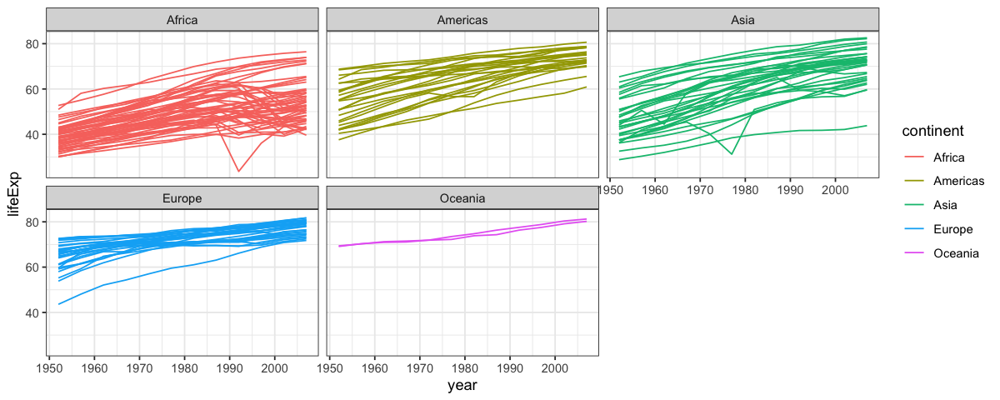

```{r setup, include=FALSE}
knitr::opts_chunk$set(echo = TRUE)
```

# Plotting using R

## 1. Week 4

-   Anatomy of `ggplot`
-   Scatter plots
-   Line plots

## 2. Week 5

-   Bar Plots
-   Histograms
-   Multiple geoms, multiple `aes()`
-   All other plots

## 3. Week 6, Tuning plots

-   Scales
-   Colors
-   Titles and labels
-   Themes
-   Save your plot

## Sync your Repo

-   Open GitHub Desktop
-   Click "Current Branch" (should be "Main")
-   You will see a branch of "upstream/main". Select branch "Main", click "Choose a branch to Merge into **Main**".
-   Choose "upstream/main", merge into your own "Main". After merging, click "Push Origin".

## Get the data

We are using the gapminder dataset (<https://www.gapminder.org/data>) that has been put into an R package by @bryan2017 so we can load it with `library(gapminder)`.


```{r, message=F, include = TRUE}
library(tidyverse)
library(gapminder)

```

Let's create a new shorter tibble called `gapdata2007` that only includes data for the year 2007.

```{r, results = "hide"}
gapdata2007 <- gapminder %>% 
  filter(year == 2007)
```

loads the gapminder dataset from the package environment into your Global Environment

```{r}
gapdata <- gapminder
```

Both `gapdata` and `gapdata2007` now show up in the Environment tab and can be clicked on/quickly viewed as usual.

## Homework Week 4

In the class we have the generated a line chart for `lifeExp ~ year` using the following code. 

```{r}
library(tidyverse)
library(gapminder)

gapdata %>% 
  ggplot(aes(x = year, y = lifeExp, group = country, color = continent)) +
  facet_wrap(~ continent) + 
  geom_line() + theme_bw()
```

Modify the code to change the figure into this one. Use `theme_bw()`




```{r}
gapdata %>% 
  ggplot(aes(x = year, y = lifeExp, group = country, color = continent)) +
  geom_line() + 
  facet_wrap(~continent) + theme_bw()
```

## Bar Plots

There are two geoms for making bar plots - `geom_col()` and `geom_bar()` and the examples below will illustrate when to use which one.
In short: if your data is already summarized or includes values for `y` (height of the bars), use `geom_col()`.
If, however, you want `ggplot()` to count up the number of rows in your dataset, use `geom_bar()`.
For example, with patient-level data (each row is a patient) you'll probably want to use `geom_bar()`, with data that is already somewhat aggregated, you'll use `geom_col()`.
There is no harm in trying one, and if it doesn't work, trying the other.

### Summarised data

* `geom_col()` requires two variables `aes(x = , y = )`
* `x` is categorical, `y` is continuous (numeric)


Let's plot the life expectancy in 2007 in these three countries:

```{r}
gapdata2007 %>% 
  filter(country %in% c("United States", "France", "Germany")) %>% 
  ggplot(aes(x = country, y = lifeExp)) +
  geom_col() 
```

### Countable data

* `geom_bar()` requires a single variable `aes(x = )`
* this `x` should be a categorical variable
* `geom_bar()` then counts up the number of observations (rows) for this variable and plots them as bars.

Our `gapdata2007` tibble has a row for each country. 
Therefore, if we use the `count()` function on the `continent` variable, we are counting up the number of countries on each continent:

```{r}
gapdata2007 %>% 
  count(continent)
```

If we would like to plot number of countries per continent, we can use `geom_col()` on the summarized data like this:

```{r}
gapdata2007 %>% 
  count(continent) %>% 
  ggplot(aes(x = continent, y = n)) + 
  geom_col() + 
  theme_bw()
```

Or, we can just use `geom_bar()` without running `count()`, `geom_bar()` basically run the `count()` function and plots it. 

```{r}
gapdata2007 %>% 
  ggplot(aes(x = continent)) + # notice here only used `continent` as `x`, no `y`. 
  geom_bar() + 
  theme_bw()

```

We can add color to each country. 

```{r}
gapdata2007 %>% 
  ggplot(aes(x = continent, color = country)) +
  geom_bar(fill = NA) +
  theme_bw() + 
  theme(legend.position = "none")

```


We have added `theme(legend.position = "none")` to remove the legend - it includes all 142 countries and is not very informative in this case.
We're only including the colors for a bit of fun.

We're also removing the fill by setting it to NA (`fill = NA`). 
Note how we defined `color = country` inside the `aes()` (as it's a variable), but we put the fill inside `geom_bar()` as a constant.

### `color` vs `fill`

Color is the border around a geom, whereas fill is inside it.
Both can either be set based on a variable in your dataset (this means `color = ` or `fill = ` needs to be inside the `aes()` function), or they could be set to a fixed color.

R has an amazing knowledge of color.
In addition to knowing what is "white", "yellow", "red", "green" etc. (meaning we can simply do `geom_bar(fill = "green")`), it also knows what "aquamarine", "blanchedalmond", "coral", "deeppink", "lavender", "deepskyblue" look like (among many many others; search the internet for "R colors" for a full list).

I will show you a few tricks to choose beautiful color palettes in next week. 


### Proportions 

Whether using `geom_bar()` or `geom_col()`, we can use fill to display proportions within bars.
Furthermore, sometimes it's useful to set the x value to a constant - to get everything plotted together rather than separated by a variable.
So we are using `aes(x = "Global", fill = continent)`. 
Note that "Global" could be any word - since it's quoted `ggplot()` won't go looking for it in the dataset:

```{r, fig.height=4, fig.width=3}
gapdata2007 %>% 
  ggplot(aes(x = "Global", fill = continent)) + 
  geom_bar() + 
  theme_bw()
```

## Histograms

A histogram displays the distribution of values within a continuous variable. 
In the example below, we are taking the life expectancy (`aes(x = lifeExp)`) and telling the histogram to count the observations up in "bins" of 10 years (`geom_histogram(binwidth = 10)`:

```{r}
gapdata2007 %>% 
  ggplot(aes(x = lifeExp)) +
  geom_histogram(binwidth = 10)
```

We can see that most countries in the world have a life expectancy of ~70-80 years (in 2007), and that the distribution of life expectancy globally is not normally distributed.
Setting the binwidth is optional, using just `geom_histogram()` works well too - by default, it will divide your data into 30 bins.

There are two other geoms that are useful for plotting distributions: `geom_density()` and `geom_freqpoly()`.

```{r, fig.width=6}
library(patchwork)
theme_set(theme_bw())

p0 <- gapdata2007 %>% 
  ggplot(aes(x = lifeExp)) +
  geom_histogram() + 
  labs(title = "Histogram")

p1 <- gapdata2007 %>% 
  ggplot(aes(x = lifeExp)) +
  geom_density() + 
  labs(title = "Density plot")

p2 <- gapdata2007 %>% 
  ggplot(aes(x = lifeExp)) +
  geom_freqpoly() + 
  labs(title = "Frequency plot")
  
p0 + p1 + p2 + 
  plot_annotation(tag_levels = "A", tag_prefix = "(", tag_suffix = ")")
```


## Box plots

Box plots are our go to method for quickly visualising summary statistics of a continuous outcome variable (such as life expectancy in the gapminder dataset.

Box plots include:

* the median (middle line in the box)
* inter-quartile range (IQR, top and bottom parts of the boxes - this is where 50% of your data is)
* whiskers (the black lines extending to the lowest and highest values that are still within 1.5*IQR)
* outliers (any observations out with the whiskers)

```{r}
gapdata2007 %>% 
  ggplot(aes(x = continent, y = lifeExp)) +
  geom_boxplot()
```


Another variation of box plot is violin plot `geom_violin()`

```{r}
gapdata2007 %>% 
  ggplot(aes(x = continent, y = lifeExp)) +
  geom_violin()
```


## Multiple geoms, multiple `aes()`

One of the coolest things about `ggplot()` is that we can plot multiple geoms on top of each other!

Let's add individual data points on top of the box plots:

```{r}
gapdata2007 %>% 
  ggplot(aes(x = continent, y = lifeExp)) +
  geom_boxplot() +
  # ylim(60,80) +
  # coord_cartesian(ylim = c(60,80)) + 
  geom_point()
```


More examples:

```{r}
theme_set(theme_bw())

p1 <- gapdata2007 %>% 
  ggplot(aes(x = continent, y = lifeExp)) +
  geom_boxplot() +
  geom_point()

p2 <- gapdata2007 %>% 
  ggplot(aes(x = continent, y = lifeExp)) +
  geom_boxplot() +
  geom_jitter()

p3 <- gapdata2007 %>% 
  ggplot(aes(x = continent, y = lifeExp, color = continent)) +
  geom_boxplot() +
  geom_jitter(position = position_jitter(seed = 1)) +
  theme(legend.position = "none")

p4 <- gapdata2007 %>% 
  ggplot(aes(x = continent, y = lifeExp)) +
  geom_boxplot() +
  geom_jitter(aes(color = continent), position = position_jitter(seed = 1))

p1 + p2 + p3 + p4 + plot_annotation(tag_levels = "1", tag_prefix = "(", tag_suffix = ")")
```


The only thing we've changed in (2) is replacing `geom_point()` with `geom_jitter()` - this spreads the points out to reduce overplotting.

But what's really exciting is the difference between (3) and (4).

This is new: `aes()` inside a geom, not just at the top!
In the code for (4) you can see `aes()` in two places - at the top and inside the `geom_jitter()`.
And `color = continent` was only included in the second `aes()`.
This means that the jittered points get a color, but the box plots will be drawn without (so just black).

*Nerd alert: the variation added by `geom_jitter()` is random, which means that when you recreate the same plots the points will appear in slightly different locations to ours. To make identical ones, add `position = position_jitter(seed = 1)` inside `geom_jitter()`.

### Worked example - three geoms together

Let's combine three geoms by including text labels on top of the box plot + points from above.

We are creating a new tibble called `label_data` filtering for the maximum life expectancy countries at each continent (`group_by(continent)`):

```{r}
label_data <- gapdata2007 %>% 
  group_by(continent) %>% 
  filter(lifeExp == max(lifeExp)) %>% 
  select(country, continent, lifeExp)

# since we filtered for lifeExp == max(lifeExp)
# these are the maximum life expectancy countries at each continent:
label_data
```


The first two geoms are from the previous example (`geom_boxplot()` and `geom_jitter()`).
Note that `ggplot()` plots them in the order they are in the code  - so box plots at the bottom, jittered points on the top.
We are then adding `geom_label()` with its own data option (`data = label_data`) as well as a new aesthetic (`aes(label = country)`):


```{r}
gapdata2007 %>% 
  ggplot(aes(x = continent, y = lifeExp)) +
  # First geom - boxplot
  geom_boxplot() +
  # Second geom - jitter with its own aes(color = )
  geom_jitter(aes(colour = continent)) +
  # Third geom - label, with its own dataset (label_data) and aes(label = )
  geom_label(data = label_data, aes(label = country))
```


## All other types of plots

In this chapter we have introduced some of the most common geoms, as well as explained how `ggplot()` works.
In fact, ggplot has 56 different geoms for you to use; see its documentation for a full list: https://ggplot2.tidyverse.org.

With the ability of combining multiple geoms together on the same plot, the possibilities really are endless.
Furthermore, the plotly Graphic Library (https://plot.ly/ggplot2/) can make some of your ggplots interactive, meaning you can use your mouse to hover over the point or zoom and subset interactively.

The two most important things to understand about `ggplot()` are:

* Variables (columns in your dataset) need to be inside `aes()`;
* `aes()` can be both at the top  - `data %>% ggplot(aes())` - as well as inside a geom (e.g., `geom_point(aes())`). 
This distinction is useful when combining multiple geoms. 
All your geoms will "know about" the top-level `aes()` variables, but including `aes()` variables inside a specific geom means it only applies to that one.


